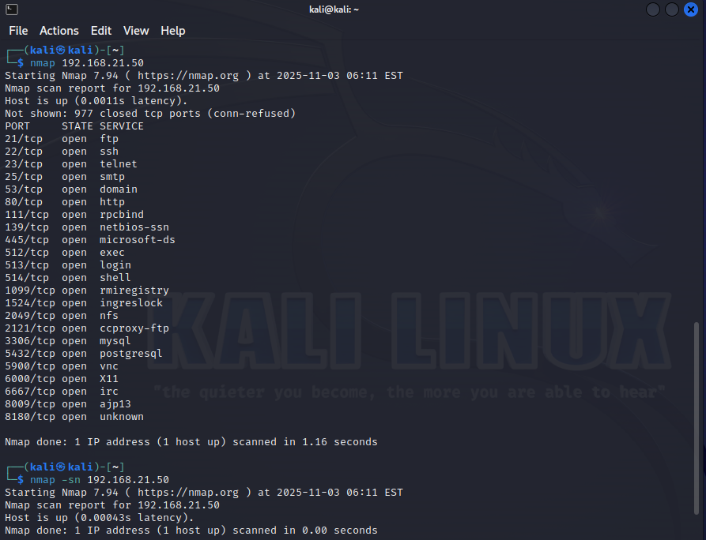

------
# Arbeitsbericht SYTD-Labor
## 4AHITS Robin Dicker 03.11.2025
------

# Übung (host discovery)

- kali ip: 192.168.21.51/24
- metasploitable ip: 192.168.21.50/24

```console
nmap 192.168.21.50
nmap -sn 192.168.21.50 // -sn scannt nicht die ports nur den Host
```

