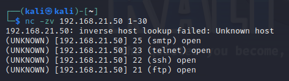

------
# Arbeitsbericht ITSE-Labor
## 4AHITS Robin Dicker 03.11.2025
------

# Übung (host discovery)

- kali ip: 192.168.21.51/24
- metasploitable ip: 192.168.21.50/24

<br>

## nmap
Der generelle Nutzen von nmap ist dass man sieht welche Geräte & Ports im Netzwerk aktiv und erreichbar sind.

```console
nmap 192.168.21.50
nmap -sn 192.168.21.50 // -sn scannt nicht die ports nur den Host
```
<br>


<br>

# Übung (port probing)


<br>

## Port Probing Cheatsheet

| Tool  | Command            | Banner Grabbing / Versioneninfo |
|-------|--------------------|---------------------------------|
| telnet| telnet <IP> <Port> | Manuell HTTP-Header eingeben    |
| nc    | nc <IP> <Port>     | Mit Here-Document: <<E0F        |
| curl  | curl -I http://<IP>| Automatisch HTTP-Header abrufen |

<br>

# Übung (netcat port scan)

- ```-z```: Kein Datentrasnfer, nur Verbindungsversuch
- ```-v```: Zeigt, ob der Port offen oder geschlossen ist.
- 1-30: Portbereich

<br>



<br>

# Übung (nmap port scan)

Nmap scannt standardmäßig die 1.000 häufigsten TCP-Ports. Auf Metasploitable findet man z.B.:

- Port 21 (FTP – vsftpd 2.3.4)
- Port 22 (SSH – OpenSSH 4.7p1)
- Port 23 (Telnet)
- Port 80 (HTTP – Apache 2.2.8)
- Port 3306 (MySQL)
- Port 5432 (PostgreSQL)


