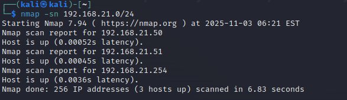
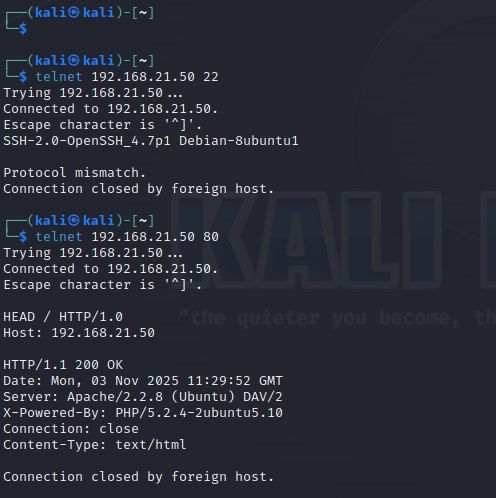
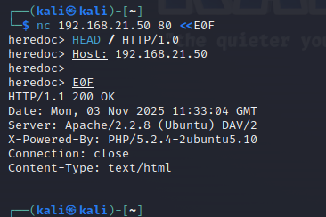
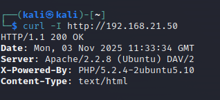

------
# Arbeitsbericht ITSE-Labor
## 4AHITS Robin Dicker 03.11.2025
------

# Übung (host discovery)

- kali ip: 192.168.21.51/24
- metasploitable ip: 192.168.21.50/24

<br>

## nmap
Der generelle Nutzen von nmap ist dass man sieht welche Geräte & Ports im Netzwerk aktiv und erreichbar sind.

```console
nmap 192.168.21.50
nmap -sn 192.168.21.50 // -sn scannt nicht die ports nur den Host
```
<br>




<br>

# Übung (port probing)







<br>

## Port Probing Cheatsheet

| Tool  | Command            | Banner Grabbing / Versioneninfo |
|-------|--------------------|---------------------------------|
| telnet| telnet <IP> <Port> | Manuell HTTP-Header eingeben    |
| nc    | nc <IP> <Port>     | Mit Here-Document: <<E0F        |
| curl  | curl -I http://<IP>| Automatisch HTTP-Header abrufen |
