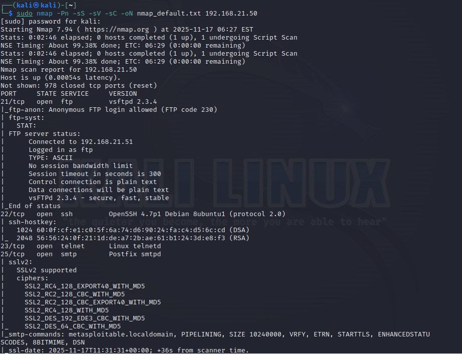
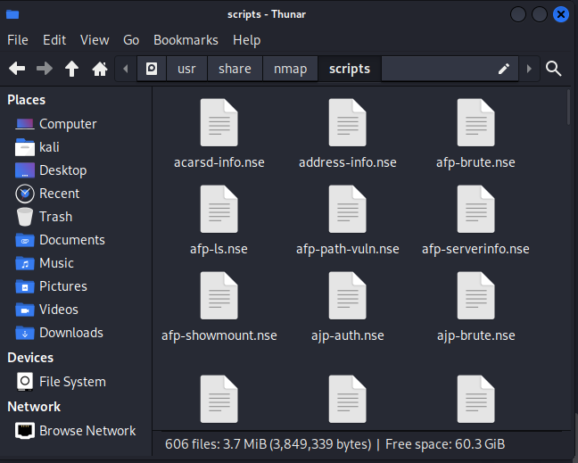
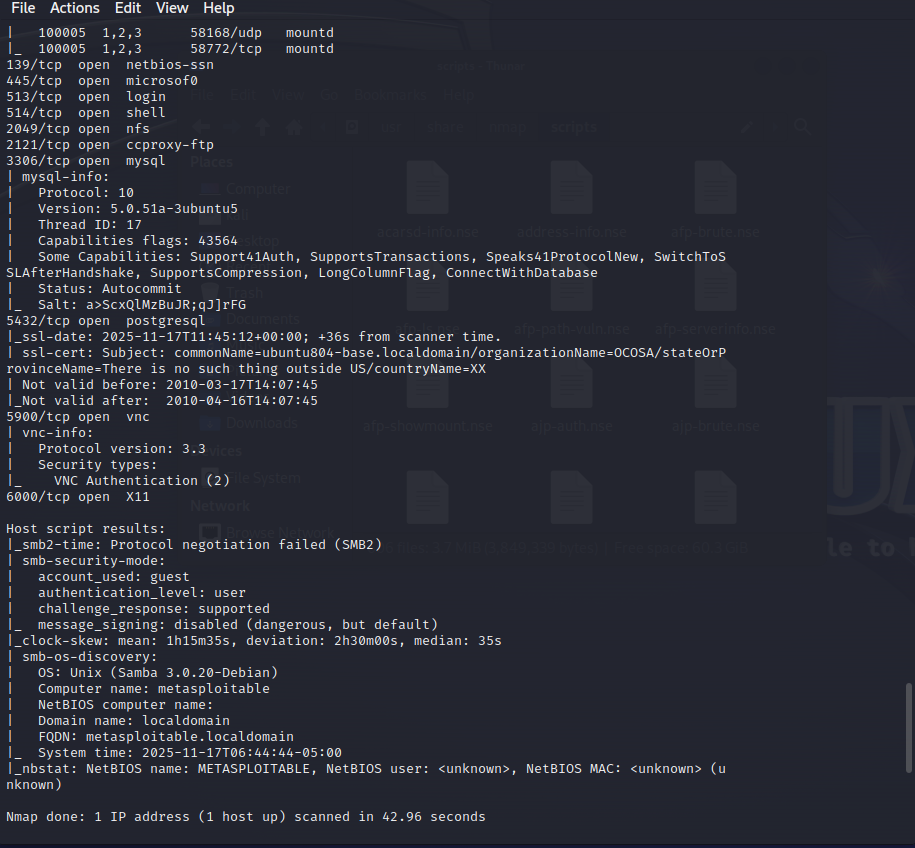
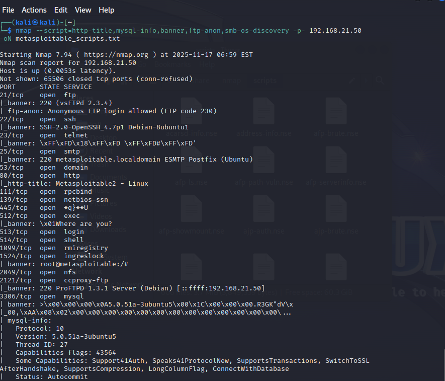
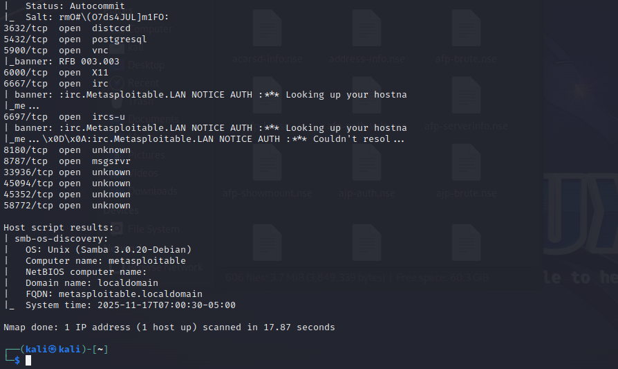
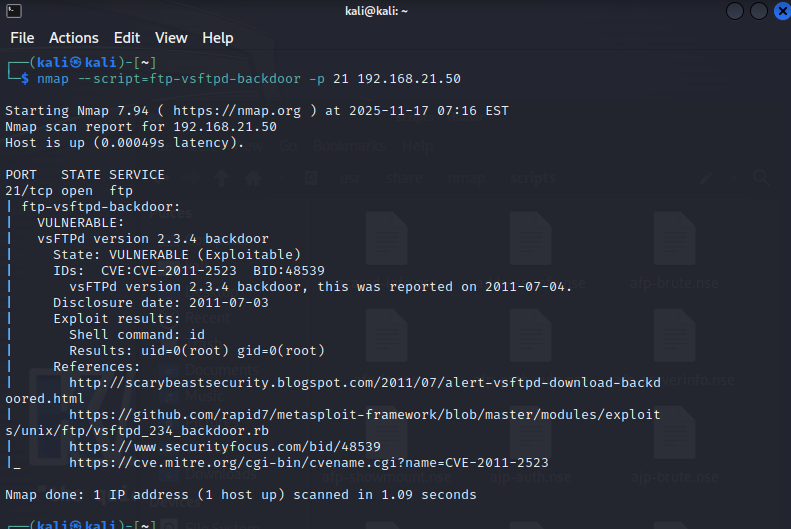

------
# Arbeitsbericht ITSE-Labor
## 4AHITS Robin Dicker 17.11.2025
------

 

# [Nmap Cheat Sheet](https://nmap.org/nsedoc/scripts/)
 

### Grundlegende Scans
- `nmap <IP>` -> Standard-Scan  
- `nmap -A <IP>`-> Aggressiver Scan (OS, Version, Skripte)  
- `nmap -Pn <IP>` -> Host-Erkennung überspringen  

### Ports
- `nmap -p 80 <IP>` -> Nur Port 80  
- `nmap -p- <IP>` -> Alle Ports  
- `nmap -F <IP>` -> Schneller Scan (häufige Ports)  

### Scan-Techniken
- `nmap -sS <IP>` -> SYN-Scan (Stealth)  
- `nmap -sT <IP>` -> TCP Connect  
- `nmap -sU <IP>` -> UDP-Scan  
- `nmap -sV <IP>` -> Service-/Versions-Erkennung  
- `nmap -O <IP>` -> OS-Erkennung  

### Timing
- `nmap -T4 <IP>` -> Schnell  
- `nmap -T5 <IP>` -> Sehr schnell (riskant)  

### Output
- `nmap -oN scan.txt <IP>` -> Normal Output  
- `nmap -oA results <IP>` -> Alle Formate  

### NSE (Skripte)
- `nmap --script=default <IP>` -> Standard-Skripte  
- `nmap --script=vuln <IP>` -> Schwachstellen-Scan  

### Kombiniere Commands für spezifischere Ergebnisse
nmap -sS -sV -O -p- -T4 <IP>

 
 

# Vulnerability Scanning

 

## Übung (Optionen)

Analysiere die Bedeutung der folgenden Optionen:

`$ nmap -Pn -sS -sV -sC -oN nmap_default.txt 192.168.21.50`

`-Pn` -> Host Erkennung überspringen, Nmap geht davon aus, dass der Host up ist
`-sS` -> Nmap verwendet nur SYN-Packete und baut keine vollständige TCP-Verbindung auf
`-sV` -> Erkennt die Version des Systems das läuft
`-sC` -> Führt die Standard-Skripte der NSE aus, diese prüfen z.B.: Banner,Standard-Infos,...
`-oN` -> Speichert die Ausgabe in Textformat in die Datei nmap_default.txt, 10.10.92.153->Ziel-IP

 

 

## Übung (vulnerability scan)

nmap verfügt über eine Erweiterung über die Lua Scripts ausgeführt werden können. Die installierten Lua Scripts befinden sich im Directory /usr/share/nmap/scripts.

 

### Übung 1:

`nmap -sC -F 192.168.21.50 -oN metasploitable_sC_F.txt`

 

### Übung 2:

5 Skripte ausführen

`nmap --script=http-title,mysql-info,banner,ftp-anon,smb-os-discovery -p- 192.168.21.50 -oN metasploitable_scripts.txt`

`http-title` -> Liest den Titel von HTTP-Seiten
`mysql-info` -> Infos über MySQL-Server
`banner` -> Liest Banner von Diensten aus
`ftp-anon` -> Prüft auf anonymen FTP-Zugang
`smb-os-discovery` -> Erkennt OS über SMB

 

### Übung 3:

Finde ein weiters Skript das sinnvolle Infos findet:
`ftp-vsftpd-backdoor` prüft ob der vsftpd 2.3.5 FTP-Server läuft der eine bekannte Backdoor enthält.

 

