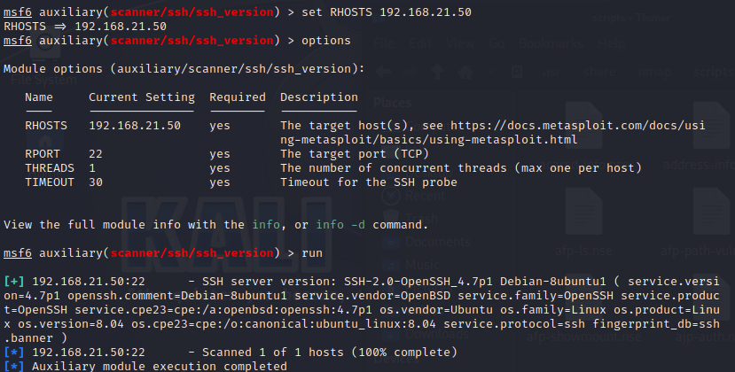
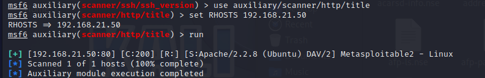
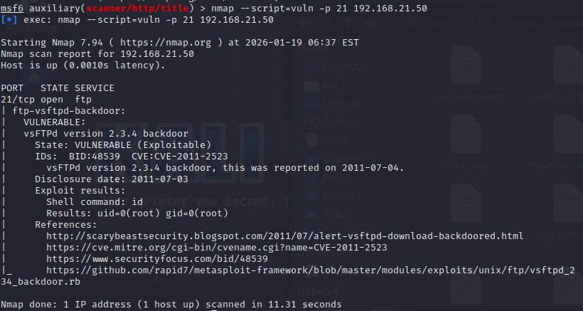
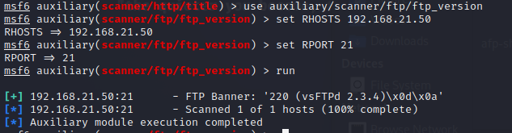
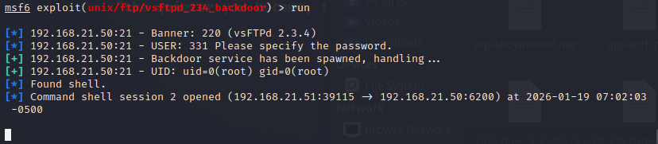
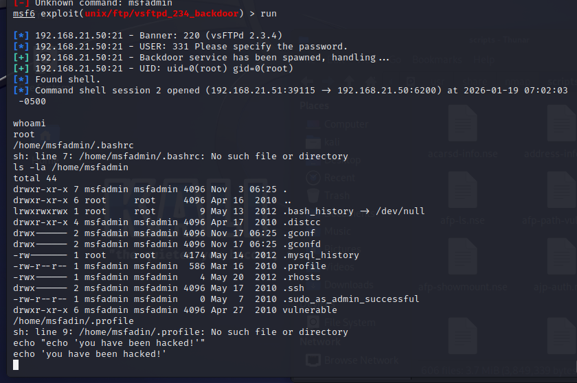
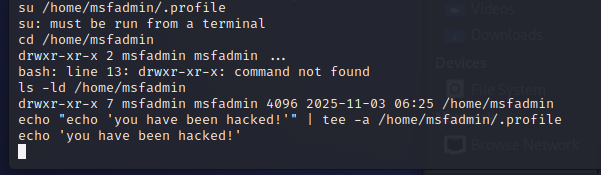
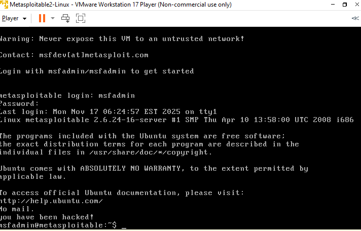

------
# Arbeitsbericht ITSE-Labor
## 4AHITS Robin Dicker 19.01.2026
------

## Gemeinsame Übung (Metasploit)

- `msfconsole` um in die Metasploit shell zu kommen

### SSH Version:

-  `use auxiliary/scanner/ssh/ssh_version` um in die SSH Version umzusteigen
-  `set RHOSTS <target IP>` Ziel Host für Attacke festlegen
-  `run` ausführen 

 

### http Title:

- `use auxiliary/scanner/http/title` um in den http Title umzusteigen
- wieder set RHOSTS <> & run

 

## Übung (msf Basics)

### Cheatsheet:

search <begriff> – Module suchen  
use <modul> – Modul laden  
info – Infos zum Modul  
show options – Optionen anzeigen  
show payloads – verfügbare Payloads anzeigen  
set <option> <wert> – Option setzen  
unset <option> – Option löschen  
exploit oder run – Angriff starten  
exploit -j – im Hintergrund starten  
exploit -z – ohne Session-Interaktion starten  
setg - setzt globable Variable z.b.: setg LHOST <ip>

  
 
### msfvenom

msfvenom kombiniert die früheren Tools msfpayload und msfencode.
 

-p – Payload auswählen  
-f – Ausgabeformat (exe, elf, raw, php, …)  
-e – Encoder  
-a – Architektur  
--platform – Zielplattform  
-l payloads – alle Payloads anzeigen  
--payload-options – Optionen eines Payloads anzeigen

  

### Meterpreter

Meterpreter ist ein post‑exploitation Framework, das über eine Metasploit‑Payload geladen wird.
 

sysinfo – Systeminformationen  
getuid – aktuellen Benutzer anzeigen  
ps – Prozesse anzeigen  
migrate <pid> – in anderen Prozess wechseln  
upload <file> – Datei hochladen  
download <file> – Datei herunterladen  
shell – normale System-Shell öffnen  

  

 ## Übung (nmap FTP scan)

nmap scan mit:
 
nmap --script=vuln -p 21 <ip> 
 

 

- "vsftpd 2.3.4 backdoor vulnerability" gefunden
 

CVE‑2011‑2523 – vsFTPd 2.3.4 Backdoor:
 
Ein Angreifer kann sich mit einem Benutzername anmelden, der ein :) enthält.
 
Dadurch öffnet der Server eine Backdoor‑Shell auf Port 6200.
 
Diese Backdoor wurde absichtlich in die veröffentlichte Version eingebaut
 

Recherchiere warum diese Skripte als intrusive bezeichnet werden, warum werden diese bei -sC oder -A nicht ausgeführt?
 
Sie sind intrusive weil sie:
- Senden speziell präparierte Pakete
- Versuchen Exploits auszulösen
- Testen Login‑Versuche
- Provozieren Fehlerzustände
- Können Dienste zum Absturz bringen
   

## Übung (msf FTP Version herausfinden)

- search type:auxiliary scanner ftp -> auxiliary/scanner/ftp/ftp_version

- use auxiliary/scanner/ftp/ftp_version

- set RHOSTS <ip> -> run

- "Banner: 220 (vsFTPd 2.3.4)" bestätigt die Version 2.3.4

 

## Übung (msf vsftpd exploit)

